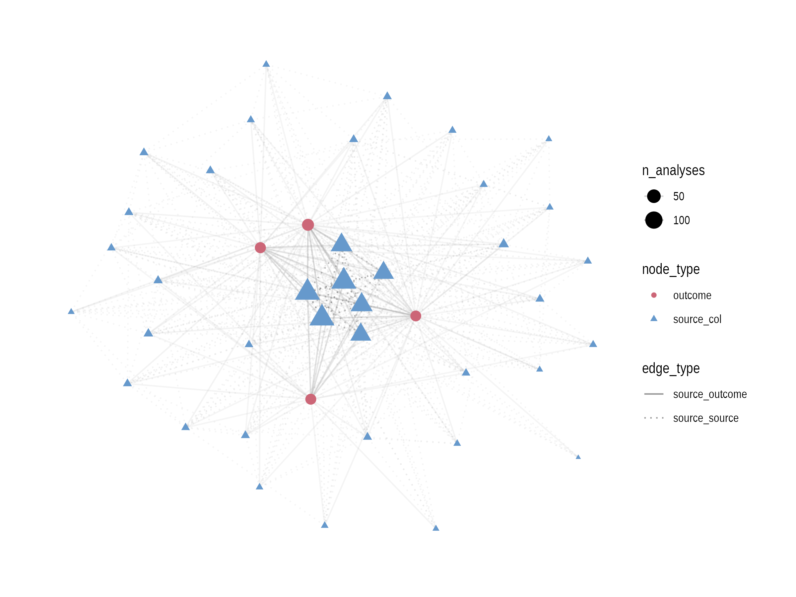
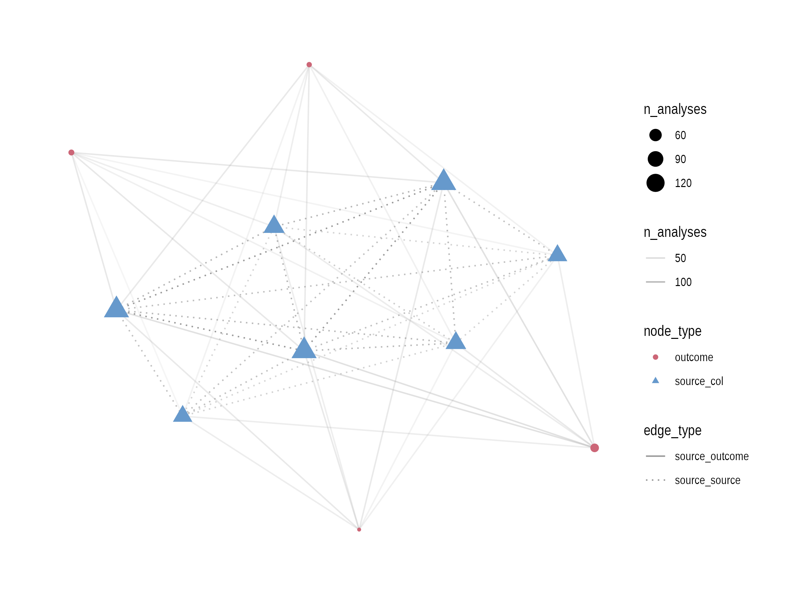

# questionability

This project explores graphical analyses of how different analysts might decompose a domain question into an analytic question given the same data.

A graph is a network determined by *nodes* and *edges*.

The simulation provides us with a way of **exploring** *before any lengthy extraction of data*:

- what kinds of visualisations might be useful to illustrate the diversity of analytic question decomposition;
- what kinds of graph structures emerge from the decomposition process;
- what data we need to extract and how it should be structured.

## minimal representations of core results

The goal is to explore **minimal representations that faithfully align with the experiment's core results**, not find the perfect sampling technique or predict analyst behaviour.  

## graph visualisations

Graph visualisations illustrate the diversity of how analysts decompose. This project explores different graph presentations. 

We are using [`ggraph`](https://ggraph.data-imaginist.com/) to create the visualisations. 

> Todo: add caption highlighting most-popular source columns and outcomes

### all analyses graph



### popular analyses graph



## simulation study for analytic question decomposition

The targets pipeline simulates how different analysts might use source columns to decompose the given domain question into an analytic question with the same data (in terms of source columns).

To inspect the pipeline using the (installed) `targets` package, you need to run the full simulation pipeline.

```r
targets::tar_make()
```  

Inspect the simulation design.

```r
targets::tar_visnetwork(targets_only = TRUE)
```

Inspect the built pipeline graph.

```r
targets::tar_visnetwork()
``` 

Inspect a specific pipeline object.

```r
targets::tar_read(simulated_analyses)
``` 

Finally, if you're feeling playful, change the simulation parameters by modifying the `_targets.R` file which calls functions from `R/`.

The `poc/poc.R` file is the original script where the simulation was prototyped from `poc/analytic_question.md`.

## graph structure

- nodes: 
  - shaped by:
    - source columns
    - (transformations on source columns, not in first pass)
    - outcome distributions
  - sized by: number of analyses that used that variable
  - (future: sizing/colouring by pooled significance and/or effect size, but unlikely to be easily extractable from this experiment)

- edges connect nodes within an analysis, linetype by:
  - **from source → to outcome** weighted by number of analyses that used that source column to derive outcome
  - **between source columns** weighted by number of analyses that used both source columns
  - (future extension possibility: source → transformation → outcome edges, but not in first pass)
- we will explore fans, weight, or alpha in the visualisation for edge density


## extensibility

A final note, this simulation is readily extensible to other analytic questions by swapping out the dataset read and tweaking expected parameter objects in the pipeline. 
