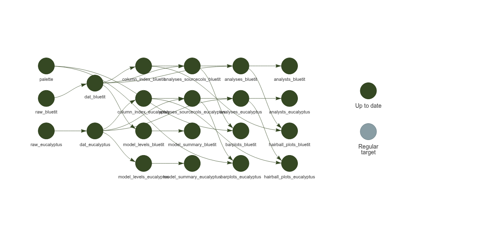

# Simulation Study for Analytic Question Decomposition

> **Note:** The simulation pipeline has been modularised and is now located in [`R/simulation_factory_targets.R`](../R/simulation_factory_targets.R). This was the original development approach before real data became available.

The simulation provides us with a way of **exploring** *before any lengthy extraction of data*:

- what kinds of visualisations might be useful to illustrate the diversity of analytic question decomposition;
- what kinds of graph structures emerge from the decomposition process;
- what data we need to extract and how it should be structured.

## Running the Simulation

To run the simulation pipeline, first uncomment the simulation factory call in `_targets.R`:

```r
# simulation factory (modularised in R/simulation_factory_targets.R) ----
get_simulation_factory_targets(),  # <- uncomment this line
```

Then run the pipeline:

```r
targets::tar_make()
```  

## Inspecting the Pipeline

Inspect the simulation design:

```r
targets::tar_visnetwork(targets_only = TRUE)
```



Inspect the built pipeline graph:

```r
targets::tar_visnetwork()
``` 

Inspect a specific pipeline object:

```r
targets::tar_read(simulated_analyses)
``` 

## Simulation Parameters

The simulation is controlled by parameters defined in `R/simulation_factory_targets.R`:

- `sim_n_analyses`: Number of analyses to simulate (default 142, matching bluetit dataset)
- `sim_source_col_range`: Range of source columns per analysis (default 4-15)
- `sim_source_col_dist`: Distribution of column usage frequency
- `sim_source_col_use_prob`: Probability weights for column selection

## Graph Visualisations

Graph visualisations illustrate the diversity of how analysts decompose. 

### All Analyses Graph


### Popular Analyses Graph


## Graph Structure

- **nodes**: 
  - shaped by:
    - source columns
    - (transformations on source columns, not in first pass)
    - outcome distributions
  - sized by: number of analyses that used that variable
  - (future: sizing/colouring by pooled significance and/or effect size, but unlikely to be easily extractable from this experiment)

- **edges** connect nodes within an analysis, linetype by:
  - **from source → to outcome** weighted by number of analyses that used that source column to derive outcome
  - **between source columns** weighted by number of analyses that used both source columns
  - (future extension possibility: source → transformation → outcome edges, but not in first pass)
- we will explore fans, weight, or alpha in the visualisation for edge density

## Validation

Open [`validation/validate_graph.html`](../validation/validate_graph.html) in your browser to inspect the validation report for the graph structure.

## Extensibility

This simulation is readily extensible to other analytic questions by swapping out the dataset read and tweaking expected parameter objects in the pipeline. 

## Updating Pipeline Visualisation

To regenerate the pipeline visualisation PNG:

```r
source("R/save_pipeline_visnetwork.R")
save_pipeline_visnetwork()
```
