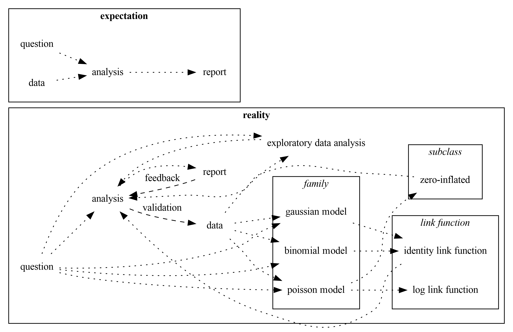
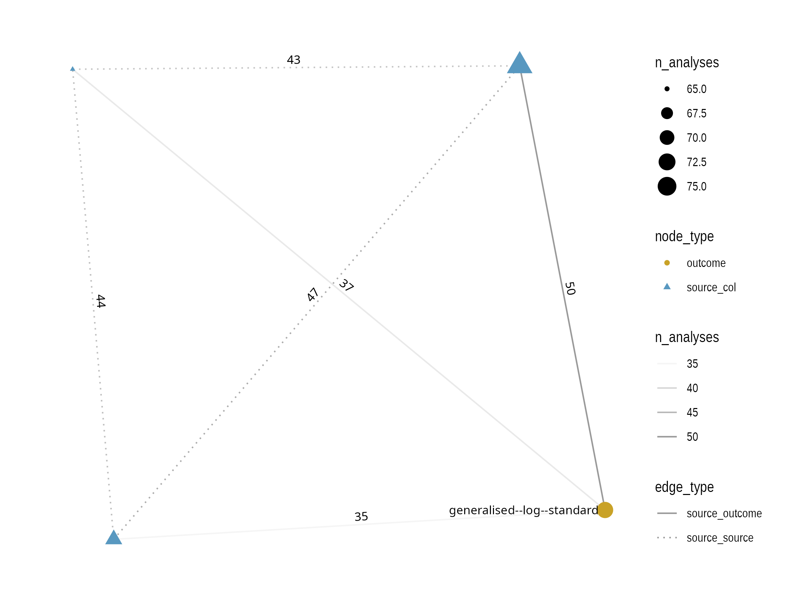
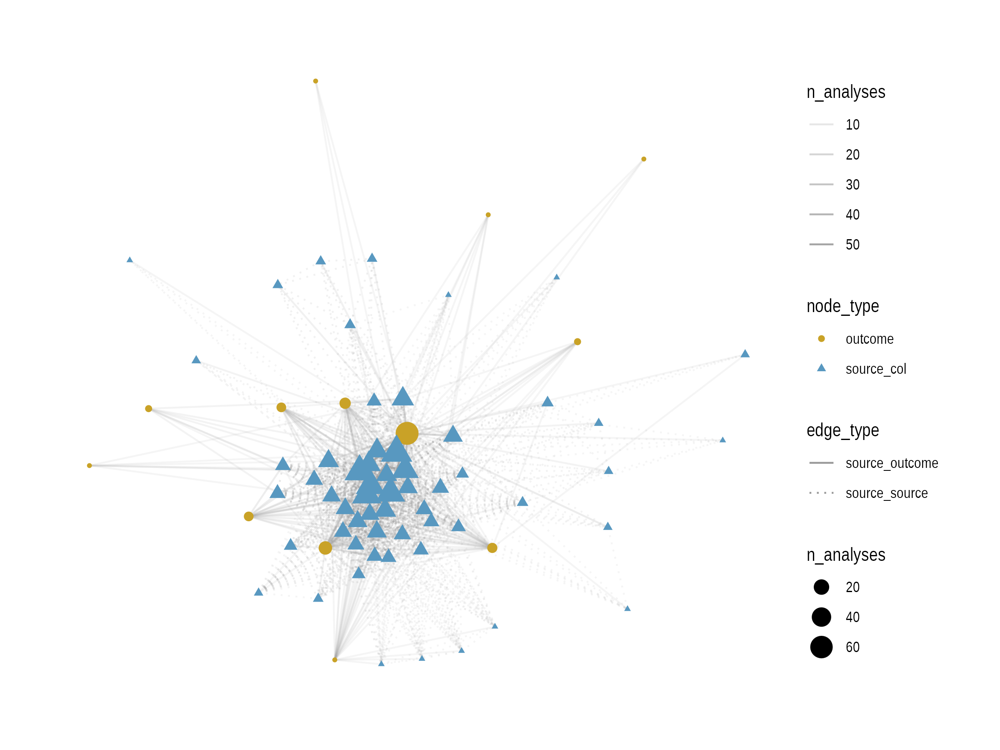
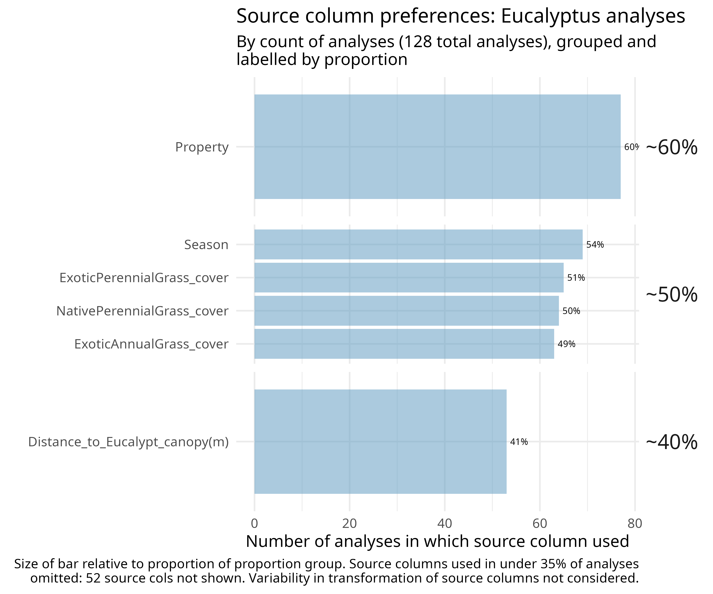

## storybook outline

This document outlines the planned visualisations for the storybook that will form the spine of the argument of the manuscript.

This began as a [googledocs slidedeck](https://docs.google.com/presentation/d/1bcSES6y9cs9DIkew2qR2UsUKsV_oVY8JOh3UUng2tZA/edit?slide=id.g3b1309aa85d_0_0#slide=id.g3b1309aa85d_0_0)
but now makes more sense to write here so we can link to issues.

# Introduction

## Challenging a fundamental assumption of science

Science assumes a clear domain question with

- well-structured data 
- with sufficient sample  coverage 

will elicit effectively the same analytic interpretation regardless of domain scientist.

**This experiment challenges that assumption.**

## [Exposing analytic diversity](https://github.com/users/softloud/projects/18/views/10?visibleFields=%5B%22Title%22%2C%22Labels%22%2C%22Status%22%2C%22Assignees%22%2C249832417%2C%22Parent+issue%22%2C%22Linked+pull+requests%22%2C%22Sub-issues+progress%22%2C%22Milestone%22%5D&pane=issue&itemId=148745787&issue=softloud%7Cquestionability%7C25)

question -> data -> *scientist* -> **analysis** 

We show the **analysis** of the data answering the question is dependent on *scientist*.

## Expectation vs reality

We expect analyses to have a shared conclusion (derived from modelling) using (mostly) agreed-upon evidence (derived from source columns).

### [Expectation](https://github.com/users/softloud/projects/18/views/10?sliceBy%5Bvalue%5D=storybook+mvp&pane=issue&itemId=148744929&issue=softloud%7Cquestionability%7C20)

### [Reality](https://github.com/users/softloud/projects/18/views/10?sliceBy%5Bvalue%5D=storybook+mvp&pane=issue&itemId=148745175&issue=softloud%7Cquestionability%7C21)

Results vary widely due to different definitions of **input** and **output**.

## Input diversity

### [Popularity](https://github.com/users/softloud/projects/18/views/10?sliceBy%5Bvalue%5D=storybook+mvp&pane=issue&itemId=148745368&issue=softloud%7Cquestionability%7C24)

### [Heatmap clustering](https://github.com/users/softloud/projects/18/views/10?sliceBy%5Bvalue%5D=storybook+mvp&pane=issue&itemId=148769565&issue=softloud%7Cquestionability%7C27)

Might be too granular.

### [Subset relationships](https://github.com/users/softloud/projects/18/views/10?sliceBy%5Bvalue%5D=storybook+mvp&pane=issue&itemId=148745205&issue=softloud%7Cquestionability%7C22)

This will show subsets of subsets.

## Output diversity

### [Number of models reported/used](https://github.com/users/softloud/projects/18/views/10?sliceBy%5Bvalue%5D=storybook+mvp&pane=issue&itemId=148773289&issue=softloud%7Cquestionability%7C29)

### [Sankey of modelling to conclusion](https://github.com/users/softloud/projects/18/views/10?sliceBy%5Bvalue%5D=storybook+mvp&pane=issue&itemId=148744505&issue=softloud%7Cquestionability%7C19)

### [Forest plot of most-popular model outcomes](https://github.com/users/softloud/projects/18/views/10?sliceBy%5Bvalue%5D=storybook+mvp&pane=issue&itemId=148745324&issue=softloud%7Cquestionability%7C23)

- Meaningless without domain interpretation of effects.
- Demonstrates that even controlling for model, outcomes are heterogeneous
- Colour by conclusion drawn

## Conclusion

### Plurality is a feature, not a bug

Plurality in analysis is to be expected. 

Describe health of the humans in a country:

- One study reports length of life relative to other countries
- Another study reports the weight of middle-aged individuals relative to other countries

Both are informative but only part of the picture. 

### Embracing plurality

This experiment demonstrates that the assumption that scientists will operationalise a domain question the same way is fundamentally flawed.

By embracing many facets of analytic framing for a domain question, evidence is more informative as a whole.
