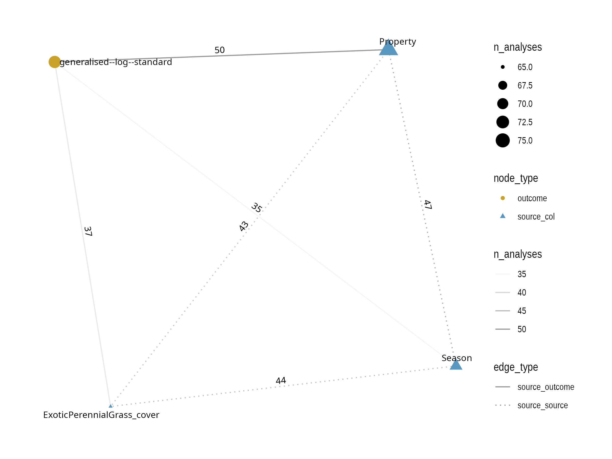

# hairballs

## all eucalyptus outcomes & source columns

## expectation hairball

# source column counts

## slide

## manuscript

## heatmap

## hasse diagram

## forest plot on most popular analytic frame 

crucially *no* aggregate, it's not necessary

## headline?

Epistemic plurality is a feature not a bug: analytic diversity in a many-analyst experiment

