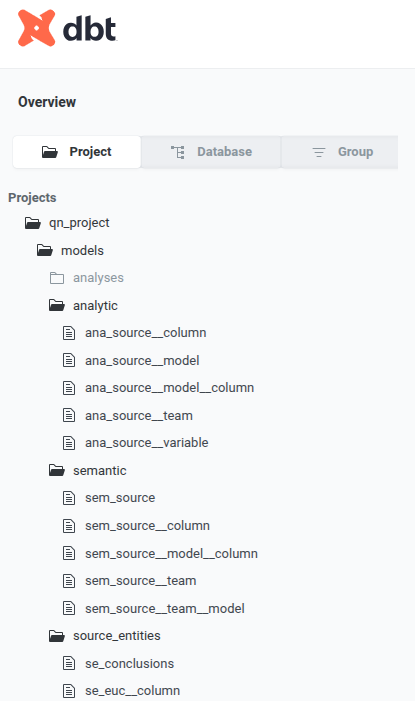
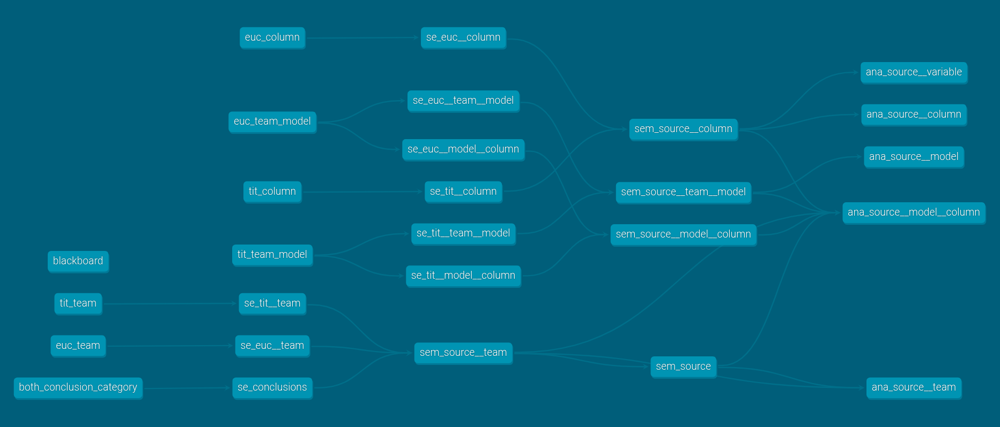

# Many analysts, many answers
150 expert teams, same data, same questions


## Analytic questions

:::: {.columns}

::: {.column width="30%"}
- 150 expert teams
- same data
- same questions

Domain question 

$\Delta$ 

Analytic Question?

:::

::: {.column width="70%"}
::: {.callout-tip title="Domain question"}
To what extent is the growth of nestling blue tits (Cyanistes caeruleus) influenced by competition with siblings?
:::
data: n rows x m columns

::: {.callout-tip title="Domain question"}
How does grass cover influence Eucalyptus spp. seedling recruitment?
:::

data: n rows x m columns
:::

::::

## Expectation

Decomposing a well-scoped domain question using data with good coverage produces the same analysis 

```{dot}
digraph G {
rankdir=LR
node[shape=none]
edge [style=dotted]

  # nodes
  e_question [label="question"]
  e_data [label="data"]
  e_analysis [label="analysis"]
  e_report [label="report"]

  # arrows
  e_question -> e_analysis -> e_report
  e_data -> e_analysis

}

```

## Forking paths 

It's turtles all the way down


```{dot}
digraph G {
rankdir=LR
node[shape=none]
edge [style=dotted]

  subgraph cluster_model {
      label=<<I>family</I>>
      r_poisson [label="poisson model"]
      r_binomial [label="binomial model"]
      r_gaussian [label="gaussian model"]
    }

    subgraph cluster_link {
      label=<<I>link function</I>>
      r_loglink [label="log link function"]
      r_identitylink [label="identity link function"]
    }

    subgraph cluster_subclass {
      label=<<I>subclass</I>>
      r_zeroinflated [label="zero-inflated"]
    }

    r_question [label="question", shape=triangle, style=filled, fillcolor="#cb4b16", fontcolor=white, fontsize=20]
    r_data [label="DATA", shape=triangle, style=filled, fillcolor="#cb4b16", fontcolor=white, fontsize=20]
    r_analysis [label="analysis", shape=triangle, style=filled, fillcolor="#cb4b16", fontcolor=white, fontsize=20]
    r_report [label="report"]
    r_eda [label="exploratory data analysis"]


    # arrows
    r_data -> r_poisson -> r_loglink
    r_question -> r_poisson
    r_data -> r_binomial -> r_identitylink
    r_question -> r_analysis
    r_data -> r_gaussian
    r_gaussian -> r_identitylink
    r_poisson -> r_zeroinflated
    r_zeroinflated -> r_analysis
    r_identitylink -> r_analysis
    r_question -> r_binomial
    r_question -> r_gaussian
    r_data -> r_eda -> r_analysis
    r_question -> r_eda

    r_analysis -> r_report
    r_analysis -> r_data [style=dashed, label="validation"]
    r_report -> r_analysis [style=dashed, label="feedback"]

}

```

# Orchestration
using Dagster to manage analytic iteration

## Our question

:::: {.columns}

::: {.column width="60%"}

::: {.callout-tip title="Our domain question"}
Domain quesiton $\Delta$ analytic question?
:::

On

- analyses, no, wait, teams
- columns... by teams
- column categories... by teams
- conclusions of multiple analyses by teams

:::

::: {.column width="40%"}

Many analyses:

- treemap
- alluvial
- meta-analysis
- barplot
- hairball graph

... and more

:::

:::

## The data

as a conceptual graph of entities

```{dot}
strict digraph {
    rankdir=LR
    edge [style=dotted]
    node [shape=none]
    style=dotted

    subgraph cluster_source {
        label=<<I>source</I>>
        
        euc__team__model
        tit__team__model
        euc__column
        tit__column
        
    }
    
    subgraph cluster_semantic {
        label=<<I>semantic</I>>
        
        source__team__model
        model__column
        
    }
    
    subgraph cluster_analytic {
        label=<<I>analytic</I>>
        
        ana___source__column [label=source__column]
        ana___source__variable [label=source__variable]
        
        # count number of teams
        ana___source__model [label=source__model]
        ana___source__from_variable__to_variable [label=source__from_variable__to_variable]
    }
    
    subgraph cluster_vis {
        label=<<I>vis</I>>

        histogram__source__team__model [label=histogram]
        hairball__source__family__column [label=hairball]
        barplot__model__column__team [label=barplot]
        sankey__model__team [label=sankey]
        heatmap__source__team__variable [label=heatmap]

    }

    euc__column -> model__column 
    tit__column -> model__column
    
    euc__team__model -> source__team__model
    tit__team__model -> source__team__model
    source__team__model -> ana___source__model
    
    ana___source__model -> histogram__source__team__model
    
    model__column -> ana___source__column
    source__team__model -> ana___source__column

    ana___source__column -> barplot__model__column__team
    ana___source__model -> sankey__model__team
    ana___source__variable -> hairball__source__family__column
    model__column -> ana___source__variable
    source__team__model -> ana___source__variable
    ana___source__variable -> heatmap__source__team__variable
    euc__team__model -> model__column
    tit__team__model -> model__column
    ana___source__from_variable__to_variable -> hairball__source__family__column
    model__column -> ana___source__from_variable__to_variable
    source__team__model -> ana___source__from_variable__to_variable


    
}
```

## the data
instantiated as a dbt graph


::: {.columns}

::: {.column width="20%"}



:::

::: {.column width="80%"}




:::

:::

## Instruments and instrumentalists

Orchestrators enable conducting instrumentalists playing different instruments to produce a symphony of analytic outputs

<hr>

::: {.columns}

::: {.column width="50%"}

### Instruments

- "the data"
- R/ggplot2
- SQL/dbt
- Python/dagster
- dot
- shell

:::

::: {.column width="50%"}

### Instrumentalists

- Datapunk (jill of all languages, mistress of none) 

- Ecologist (R) 

have domain-specific workflows

:::
:::

## The keys to the Dagster kingdom

- Assets
- Definitions
- Scaffolding
- Integration


## Assets

## Definitions

## Scaffolding

## Integration